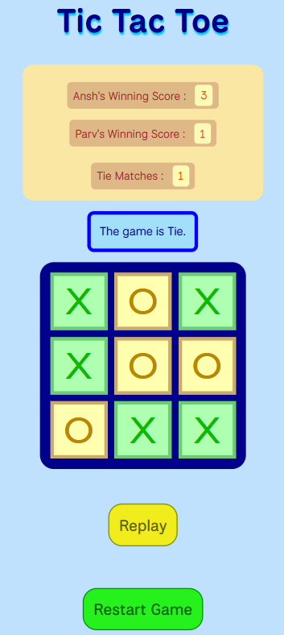

# Tic Tac Toe

A simple, interactive Tic Tac Toe game built with HTML, CSS, and JavaScript.

## Features

- Two-player mode with custom player names.
- Tracks and displays each player's winning score.
- Tie match counter.
- Animated win and result popups.
- Responsive design for desktop and mobile devices.
- Replay and restart functionality.

## Getting Started

### Prerequisites

- A modern web browser (Chrome, Firefox, Edge, etc.)

### Running the Game : https://anshpatel-24.github.io/Tic-Tac-Toe/

### File Structure

- `index.html` — Main HTML file for the game UI.
- `index.css` — Stylesheet for layout and animations.
- `index.js` — JavaScript logic for game functionality.

## How to Play

1. Enter names for both players (Player 1 is "X", Player 2 is "O").
2. Click **Start Game**.
3. Take turns clicking the grid to place your symbol.
4. The game announces the winner or a tie.
5. Use **Replay** to play again with the same names and scores, or **Restart Game** to reset everything.

## Screenshots

