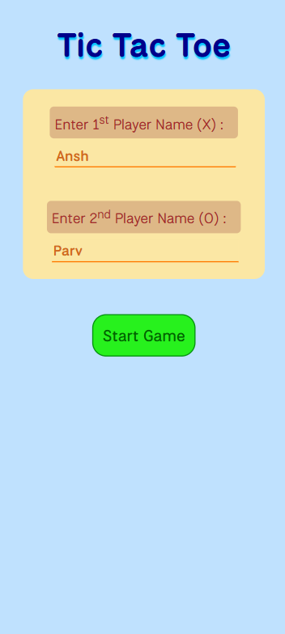
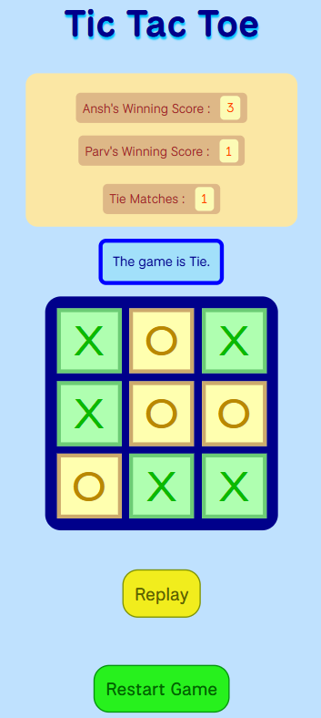

# Tic Tac Toe

An interactive Tic Tac Toe game built with HTML, CSS, and JavaScript, featuring both Player vs Player and Player vs AI modes.

## Live Demo

[Play Tic Tac Toe](https://anshpatel-24.github.io/Tic-Tac-Toe/)

## Features

- Two game modes:
  - Player vs Player (PvP)
  - Player vs AI
- Custom player names
- Score tracking system
- Tie game counter
- Animated win notifications
- Responsive design for all devices
- Replay and restart functionality
- Modern UI with smooth animations

## Technologies Used

- HTML5
- CSS3 (with Flexbox and CSS Grid)
- JavaScript (ES6+)
- Local Storage for game state management

## Game Modes

### Player vs Player

- Two players take turns
- Custom names for both players
- Track wins for each player

### Player vs AI

- Play against the computer
- Single player name entry
- AI plays as 'O'

## How to Play

1. Select game mode (PvP or AI)
2. Enter player name(s)
3. Click "Start Game"
4. Take turns placing X's and O's
5. First to get three in a row wins
6. Use "Replay" for another round or "Restart" for a fresh start

## Screenshots

